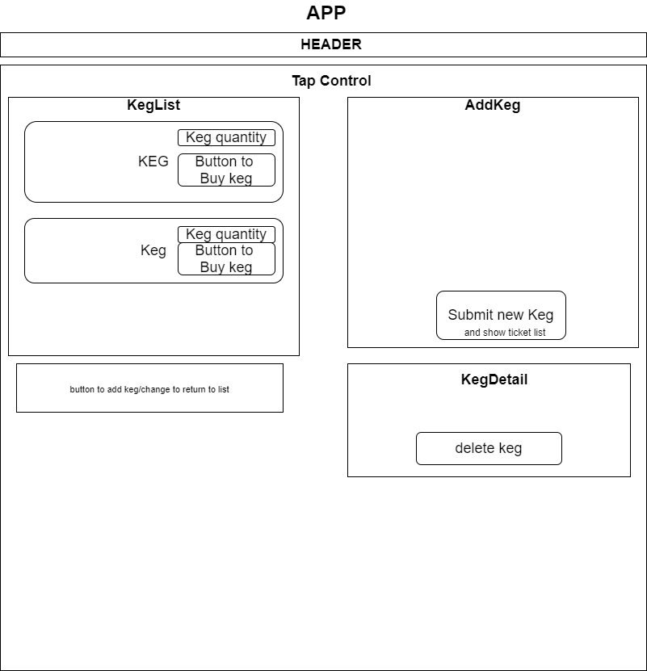

# <h1 align = "center"> `TapRoom Market & Inventory`

## <h3 align = "center">  9.11.2020

## <h2 align = "center"> `About`

 This is an application for a Taproom. The user may search an inventory of kegs, add kegs, "buy" kegs, update, and delete kegs. Demonstrating React CRUD functionality.

## **✅`REQUIREMENTS`**
* Install [Visual Studio Code](https://code.visualstudio.com/)
* Install [Git v2.62.2+](https://git-scm.com/downloads/)
* Install [.NET version 3.1 SDK v2.2+](https://dotnet.microsoft.com/download/dotnet-core/2.2)
* Install [MySql Workbench](https://www.mysql.com/products/workbench/)

## **💻`SETUP`**
* to clone this content, copy the url provided by the green 'Code' button in GitHub
* in command line use the command 'git clone (GitHub url)'
* open the program in a code editor
* navigate to the Taproom directory and type dotnet build in the command line to compile the code
* remaining in the Taproom directory type dotnet ef database update to create the database
* type dotnet run in the command line to run the program

## 🔍`Specs`

| Behavior    | Input | Output |
| :---------- | ----- | -----: |
| User can search through a list of kegs | none | none |
| User can add new kegs with pint, name, and alcohol content | none | none |
| User can buy a pint | none | list |
| Program will decrement pint quantity after users buy pint | none | none |
| Program can Update/edit Keg information| none | none |
| Program can delete a keg | none | none |

--------
--------
## 🐛`Component Tree`

## 🐛`Known Bugs`

_No known bugs_

## 📫`Support and contact details`

Contact : Chris Yoon at chy.yoon@gmail.com

## 🔧`Technologies Used`

* Javascript
* React

## **📘 `License`**

